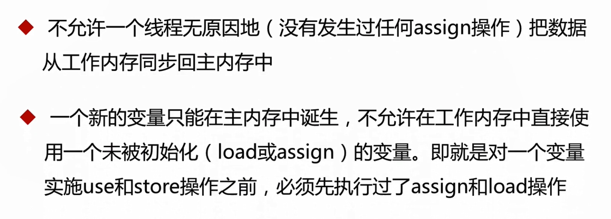
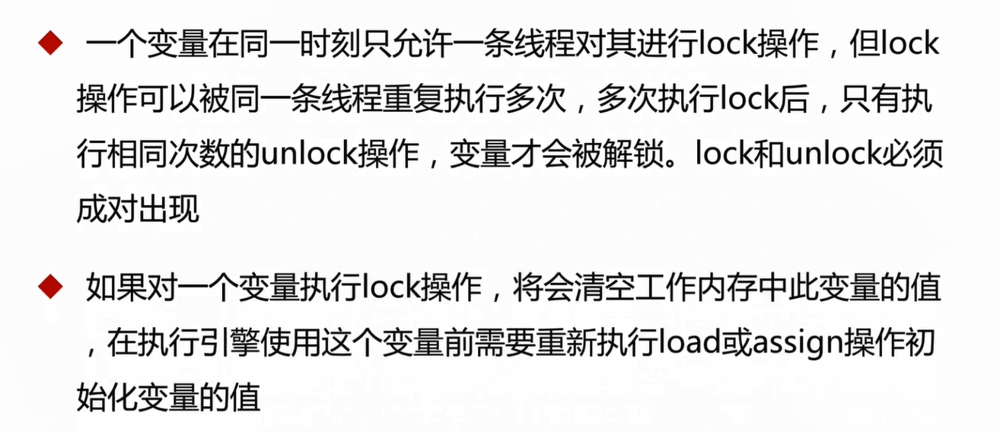
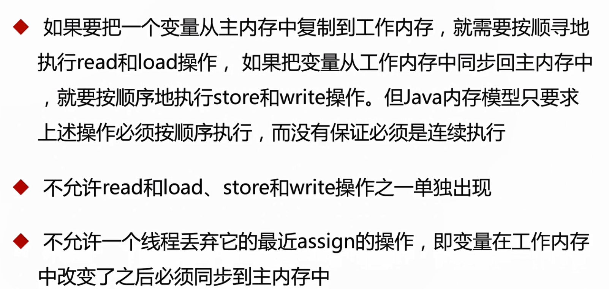
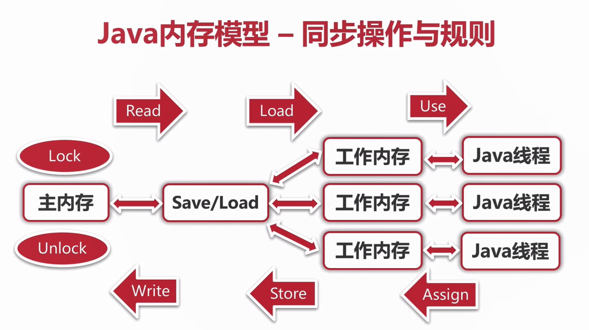
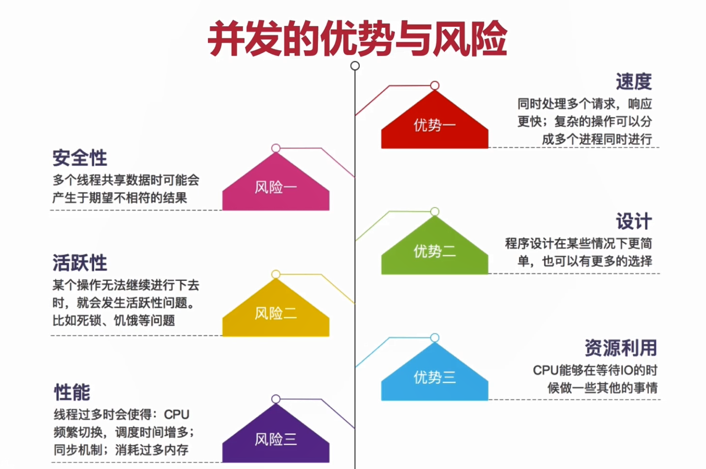

# 并发基础

## CPU多级缓存

​	并发：多个线程操作相同的资源，保证线程安全，合理使用资源

​	高并发：服务能同事处理很多请求，提高程序性能

- 为什么需要CPU cache

  ​	CPU的频率太快了，快到主存跟不上，这样在处理器时钟周期内，CPU常常需要等待主存，浪费资源。所以cache的出现，是为了缓解CPU和内存之间这速度的不匹配问题（结构：CPU->cache->memory）

- CPU cache有什么意义
  1. 时间局部性：如果某个数据被访问，那么在不就的将来它很可能能被再访问
  2. 空间局部性：如果某个数据被访问，那么与它相邻的数据很快也可能访问

### 缓存一致性（MESI）

​	用于保证多个CPU cache之间缓存共享数据的一致

|      | M    | E    | S    | I    |
| ---- | ---- | ---- | ---- | ---- |
| M    | ×    | ×    | ×    | √    |
| E    | ×    | ×    | ×    | √    |
| S    | ×    | ×    | √    | √    |
| I    | √    | √    | √    | √    |

### 乱序执行优化

​	处理器提高运算速度而做出违背代码原有顺序的优化

## Java内存模型

​	Java内存模型（Java Memory Model JMM）

### 同步的八种操作

### 同步操作和规则

## 并发的优势与风险

