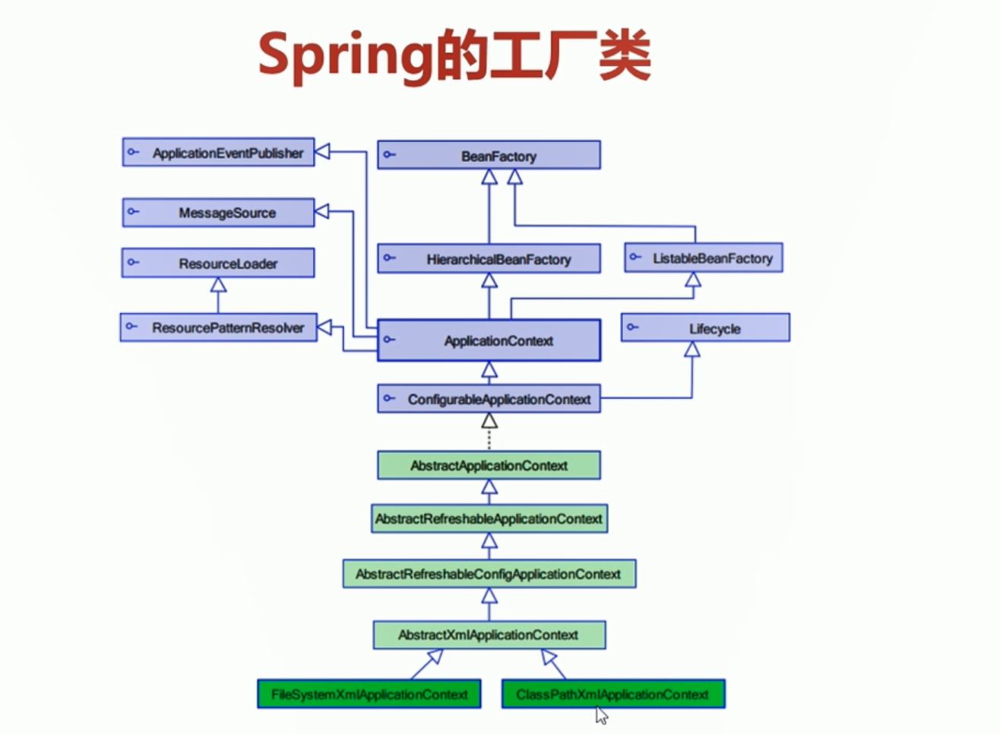
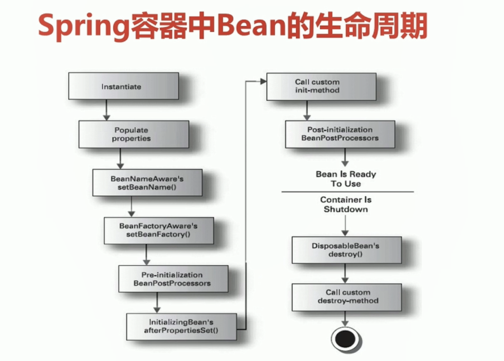
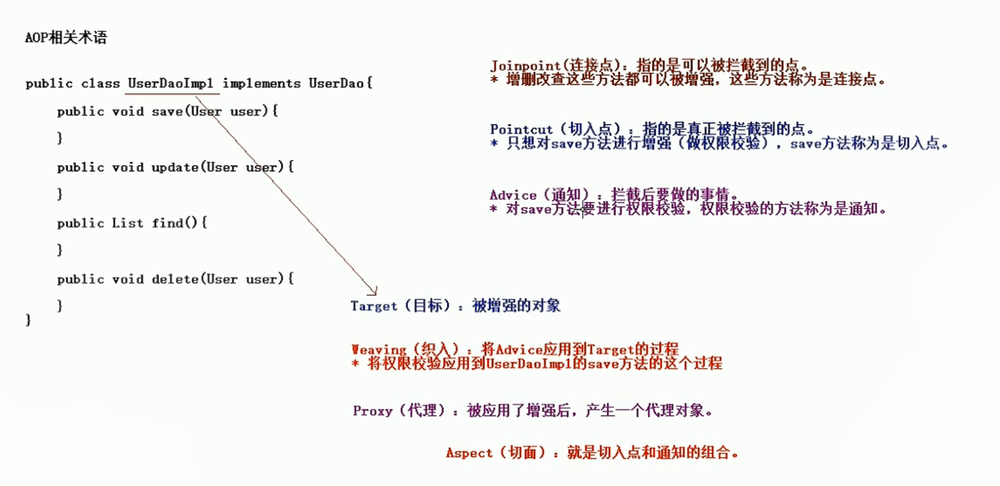
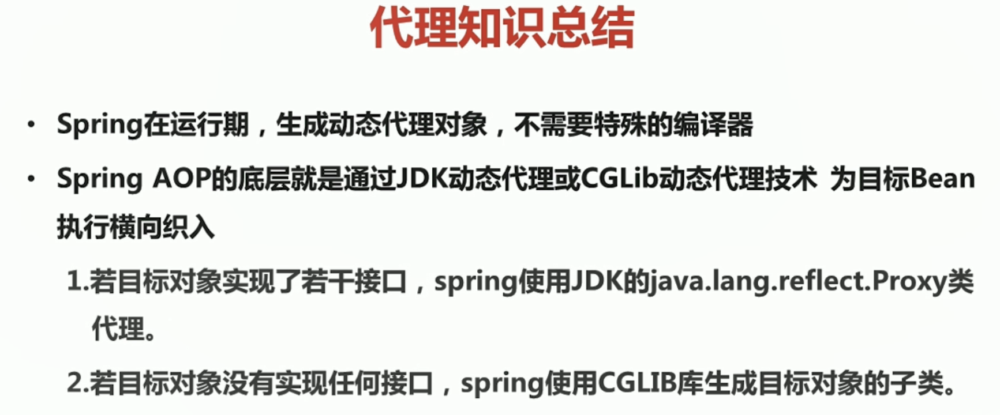
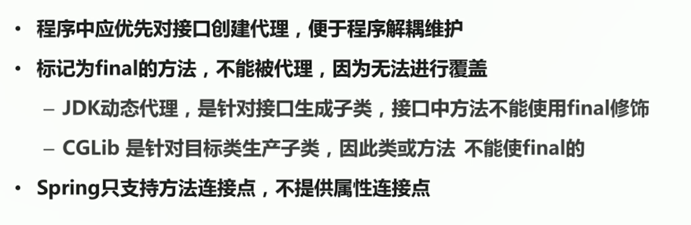

# Spring的概述

- Spring是一个开源框架
- Spring
- Spring是JavaSE/EE的一站式框架（有）

## Spring 的优点

- 方便管理，简化开发
- AOP编程的支持
- 声明式事务的支持
- 方便程序的测试
- 方便集成各种优秀框架
- 降低JavaEE API的使用难度

## Spring的模块


## SpringIOC的底层实现原理


# Spring Bean管理

## Spring入门

### 下载地址

- Spring官网下载地址：https://repo.spring.io/libs-release-local/org/springframework/spring/

### 需引入Jar包【*】

```
        <!--核心开发包-->
        <dependency>
            <groupId>org.springframework</groupId>
            <artifactId>spring-core</artifactId>
            <version>5.1.9.RELEASE</version>
        </dependency>
        <dependency>
            <groupId>org.springframework</groupId>
            <artifactId>spring-context</artifactId>
            <version>5.1.9.RELEASE</version>
        </dependency>
        <dependency>
            <groupId>org.springframework</groupId>
            <artifactId>spring-beans</artifactId>
            <version>5.1.9.RELEASE</version>
        </dependency>
        <dependency>
            <groupId>org.springframework</groupId>
            <artifactId>spring-expression</artifactId>
            <version>5.1.9.RELEASE</version>
        </dependency>
        
        <!--日志相关-->
        <dependency>
            <groupId>commons-logging</groupId>
            <artifactId>commons-logging</artifactId>
            <version>1.2</version>
        </dependency>
        <dependency>
            <groupId>log4j</groupId>
            <artifactId>log4j</artifactId>
            <version>1.2.17</version>
        </dependency>
```

传统方式和Spring方式

```
/**
 * 传统方式开发
 */
@Test
public void demo01(){
    UserService userService = new UserServiceImpl();
    userService.sayHello();
}

/**
 * Spring方式
 */
@Test
public void demo02(){
    // 创建Spring工厂
    ApplicationContext applicationContext = new ClassPathXmlApplicationContext("applicationContext.xml");
    // 通过工厂活得类
    UserService userService = (UserService) applicationContext.getBean("userService");
    userService.sayHello();
}
```

**默认配置文件：applicationContext**

```
<!-- UserService的创建权交给了Spring -->
<bean id="userService" class="com.ioc.demo01.UserServiceImpl">
	<property name="name" value="张三"/>
</bean>
```

### IOC和DI的概念

- IOC：inverse of Control 控制反转，就是将原本在程序中手动创建UserService对象的控制权，交给Spring框架管理
- 简单说，就是创建UserService对象控制权被控制权反转到了Spring框架
- DI：Dependency Injection 依赖注入，就是在Spring创建这个对象的过程中，将这个对象所依赖的属性注入进去。

## Spring工厂类

### 介绍



### FileSystemXmlApplicationContext

读取其他路径的配置文件

```
@Test
public void demo03(){
    // 创建Spring的工厂类
    ApplicationContext applicationContext = new FileSystemXmlApplicationContext("D:\\applicationContext.xml");

    UserService userService = (UserService) applicationContext.getBean("userService");

    userService.sayHello();

}
```

### 传统方式的工厂类

读取默认配置文件

```
@Test
public void demo04(){
    // 创建工厂类
    BeanFactory beanFactory= new XmlBeanFactory(new ClassPathResource("applicationContext.xml"));
    UserService userService = (UserService) beanFactory.getBean("userService");
    userService.sayHello();
}
```

读取其他路径配置文件

```
@Test
public void demo05(){
    // 创建工厂类
    BeanFactory beanFactory= new XmlBeanFactory(new FileSystemResource("D:\\applicationContext.xml"));
    UserService userService = (UserService) beanFactory.getBean("userService");
    userService.sayHello();
}
```

## Spring的Bean管理

### 实例化Bean的三种方式

- 使用类类构造器实例化（默认无参数）（一般使用这种）

  ```
  <!--第一种方式-->
  <bean id="bean" class="com.hyz.ioc.demo02.Bean01"/>
  ```

- 使用静态工厂方法实例化（简单工厂模式）

  applicationContext.xml

  ```
  <!--第二种方式-->
  <bean id="bean02" class="com.ioc.demo02.Bean02Factory" factory-method="createBean02"/>
  ```

  工厂类

  ```
  public class Bean02Factory {
      public static Bean02 createBean02(){
          System.out.println("Bean02Factory的createBean02方法执行了");
          return new Bean02();
      }
  }
  ```

  **注意**：一但加载配置文件，会把配置文件中当中的类实例化

- 使用实例化工厂方法实例化（工厂方法模式）

  实例工厂跟静态工厂的主要区别是方法是否是静态

  非静态要现有工厂的实例

  ```
  <!--第三种方式-->
  <bean id="bean03Factory" class="com.ioc.demo02.Bean03Factory"/>
  <bean id="bean03" factory-bean="bean03Factory" factory-method="createBean03"/>
  ```

### Bean的常用配置

- id和name

  - 主要区别在于，当Bean的名称中含有特殊字符的时候，就要使用name

- class

  - class用于设置一个类的完全路径名称

- scope属性

  | 类别      | 说明                                                         |
  | --------- | ------------------------------------------------------------ |
  | singleton | 单例，不设置scope属性的默认值                                |
  | prototype | 每次调用getBean()时都会返回一个新的实例                      |
  | request   | 每次HTTP请求斗湖创建一个新的Bean，改作用域仅适用于WebApplicationContext环境 |
  | session   | 同一个HTTP Session共享一个Bean，不同的HTTP Session使用不同的Bean |

  - singleton，获取多次，都是同一个实例，地址一样
  - prototype，重新new一个，地址不一样，（spring整合struts2，struts的action是多例的，会用到）

### bean的生命周期

- init-method：Bean被实例化之后调用
- destroy-method：Bean被销毁之前调用

Man.java

```
    public Man(){
        System.out.println("Man的构造方法");
    }

    void init(){
        System.out.println("执行初始化方法");
    }

    void destroy(){
        System.out.println("执行了销毁方法");
    }
```

applicationContext.xml

```
<bean id="man" class="com.ioc.demo03.Man" init-method="init" destroy-method="destroy"/>
```

demo.java

```
    @Test
    public void demo01(){
        ClassPathXmlApplicationContext applicationContext = new ClassPathXmlApplicationContext("applicationContext.xml");

        Man man = (Man) applicationContext.getBean("man");

        System.out.println(man);

        applicationContext.close();

    }
```

输出

```
Man的构造方法
执行初始化方法
com.ioc.demo03.Man@38bc8ab5
执行了销毁方法
```

### bean的生命周期完整过程




1. instantiate bean对象实例化
2. populate properties 封装属性
3. 如果Bean实现了BeanNameAware，
4. 如果Bean实现了BeanFactoryAware或者ApplicationContextAware，
5. 如果存在类BeanPostprocessor（后处理bean）,执行**postProcessBeforeInitialization**
6. 如果Bean实现了Initialzing，执行
7. 调用`<bean init-method="myinit">`方法，自己定义的方法
8. 如果存在类BeanPostprocessor（后处理bean）,执行**postProcessAfterInitialization**
9. 执行业务方法，自己写的
10. 如果Bean实现了DispostableBean，执行
11. 调用`<bean init-method="mydestroy">`方法，自己定义的方法


**Man.java**

```
public class Man implements BeanNameAware, BeanFactoryAware,ApplicationContextAware, InitializingBean, DisposableBean {
    private String name;

    public void setName(String name) {
        System.out.println("第二步，设置属性");
        this.name = name;
    }

    public Man(){
        System.out.println("第一步：Man的构造方法，对象被初始化");
    }

    void myinit(){
        System.out.println("第七步：执行初始化方法");
    }

    void mydestroy(){
        System.out.println("第十一步：执行了自己写的销毁方法");
    }
    void run(){
        System.out.println("第九步：执行业务方法，自己写的");
    }

    @Override
    public void setBeanName(String s) {
        System.out.println("第三步：设置了Bean的值，就是那个ID值");
    }

    @Override
    public void setApplicationContext(ApplicationContext applicationContext) throws BeansException {
        System.out.println("第四步：了解工厂的信息");
    }

    @Override
    public void setBeanFactory(BeanFactory beanFactory) throws BeansException {
        System.out.println("第四步：了解工厂的信息");
    }

    @Override
    public void afterPropertiesSet() throws Exception {
        System.out.println("第六步：属性设置后");
    }

    @Override
    public void destroy() throws Exception {
        System.out.println("第十步：销毁方法");
    }
}
```

**MyBeanPostProcessor.java**

```
public class MyBeanPostProcessor implements BeanPostProcessor {

    @Override
    public Object postProcessBeforeInitialization(Object bean, String beanName) throws BeansException {
        System.out.println("第五步：初始化前");
        return bean;
    }

    @Override
    public Object postProcessAfterInitialization(Object bean, String beanName) throws BeansException {
        System.out.println("第八步：初始化后");
        return bean;
    }
}
```

**SpringDemo03**

```
public class SpringDemo03 {

    @Test
    public void demo01(){
        ClassPathXmlApplicationContext applicationContext = new ClassPathXmlApplicationContext("applicationContext.xml");

        Man man = (Man) applicationContext.getBean("man");

        man.run();

        System.out.println(man);

        applicationContext.close();

    }
}
```

**applicationContext.xml**

```
<bean id="man" class="com.ioc.demo03.Man" init-method="myinit" destroy-method="mydestroy">
     <property name="name" value="张三"/>
</bean>
<bean class="com.ioc.demo03.MyBeanPostProcessor"/>
```

**输出**

```
第一步：Man的构造方法，对象被初始化
第二步，设置属性
第三步：设置了Bean的值，就是那个ID值
第四步：了解工厂的信息
第四步：了解工厂的信息
第五步：初始化前
第六步：属性设置后
第七步：执行初始化方法
第八步：初始化后
第九步：执行业务方法，自己写的
com.hyz.ioc.demo03.Man@7ce6a65d
第十步：销毁方法
第十一步：执行了自己写的销毁方法
```

**生命周期BeanPostProcessor的作用**

与AOP相关

生命周期第八步**postProcessAfterInitialization**

```
@Override
public Object postProcessAfterInitialization(Object bean, String beanName) throws BeansException {
    System.out.println("第八步：初始化后");

    if ("userDao".equals(beanName)){
        Object proxy = Proxy.newProxyInstance(bean.getClass().getClassLoader(), bean.getClass().getInterfaces(), new InvocationHandler() {
            @Override
            public Object invoke(Object proxy, Method method, Object[] args) throws Throwable {
                if ("save".equals(method.getName())){
                    System.out.println("权限调用");
                    return method.invoke(bean,args);
                }
                return method.invoke(bean,args);
            }
        });
        return proxy;
    }else {
        return bean;
    }
}
```

### Spring的属性注入

对于类成员变量属性，属性注入有一下三种，而Spring支持前两种

- 构造函数注入

- 属性setter方法注入

- 接口注入（不常用）

#### 构造函数注入

cat.java

```
public Cat(String name, int age) {
	this.name = name;
	this.age = age;
}
```

applicationContext.xml

```
<bean id="cat" class="com.hyz.ioc.demo04.Cat">
    <constructor-arg name="age" value="16"/>
    <constructor-arg name="name" value="Hello"/>
</bean>
```

TestDemo.java

```
@Test
public void demo01(){
    ApplicationContext applicationContext = new ClassPathXmlApplicationContext("applicationContext.xml");
    Cat cat = (Cat) applicationContext.getBean("cat");
    System.out.println(cat);
}
```


属性setter方法注入

**Person.java**

```
public class Person {
    private String name;
    private int age;
    private Cat cat;

    public Cat getCat() {
        return cat;
    }

    public void setCat(Cat cat) {
        this.cat = cat;
    }

    public String getName() {
        return name;
    }

    public void setName(String name) {
        this.name = name;
    }

    public int getAge() {
        return age;
    }

    public void setAge(int age) {
        this.age = age;
    }

    @Override
    public String toString() {
        return "Person{" +
                "name='" + name + '\'' +
                ", age=" + age +
                ", cat=" + cat +
                '}';
    }
}
```

**applicationContext.xml（有个人有只猫）**

```
<bean id="cat" class="com.ioc.demo04.Cat">
	<constructor-arg name="age" value="16"/>
	<constructor-arg name="name" value="Big cat"/>
</bean>
<bean id="person" class="com.ioc.demo04.Person">
    <property name="name" value="Big Cat"/>
    <property name="age" value="18"/>
    <property name="cat" ref="cat" />
</bean>
```

**TestDemo.java**

```
@Test
public void demo02(){
    ApplicationContext applicationContext = new ClassPathXmlApplicationContext("applicationContext.xml");
    Person person = (Person) applicationContext.getBean("person");
    System.out.println(person);
}
```

**输出**

```
Person{name='Jack', age=18, cat=Cat{name='Big cat', age=16}}
```

#### P名称空间

**applicationContext.xml**

```
xmlns:p="http://www.springframework.org/schema/p"

<bean id="person" class="com.ioc.demo04.Person" p:age="19" p:name="Jack" p:cat-ref="cat"/>
```

#### SpEL注入

- SeEL：spring expression language，spring表达式语言，对依赖进行简化

- 语法：#{表达式}

- `<bean id="" value="#{表达式}">`

  - #{ ‘hello’ }：使用字符串
  - #{beanId}：使用另外一个Bean
  - #{beanId.content.toUpperCase()}：使用指定名属性，并使用方法
  - #{T(java.lang.Math).PI}：使用静态字段或方法

#### 复杂类型的属性注入

数组类型

List集合类型

Set集合类型

Map集合类型

Properties类型 	

**applicationContext.xml**

```
<bean  id="collectionBean" class="com.hyz.ioc.demo05.CollectionBean">
   
   <!--数组类型-->
    <property name="arrs">
        <list>
            <value>Hello</value>
            <value>World</value>
            <value>Hi</value>
        </list>
    </property>
   
   <!--List数组属性注入-->
    <property name="list">
        <list>
            <value>Hello</value>
            <value>World</value>
            <value>Hi</value>
        </list>
    </property>
   
   <!--Set集合属性注入-->
    <property name="set">
        <set>
            <value>Hello</value>
            <value>World</value>
            <value>Hi</value>
        </set>
    </property>
   
   <!--Map属性类型注入-->
    <property name="map">
        <map>
            <entry key="abc" value="111"/>
            <entry key="cba" value="212"/>
            <entry key="bac" value="413"/>
        </map>
    </property>
    
    <!--properties属性注入-->
    <property name="properties">
        <props>
            <prop key="username">root</prop>
            <prop key="passwoord">passwoord</prop>
        </props>
    </property>
</bean>
```

**CollectionBean.java**

```
public class CollectionBean {
    private String[] arrs; // 数组类型

    private List<String> list; // List集合类型

    private Set<String> set; // Set集合类型

    private Map<String,Integer> map; // Map集合类型

    private Properties properties; // 属性类型

    public String[] getArrs() {
        return arrs;
    }

    public void setArrs(String[] arrs) {
        this.arrs = arrs;
    }

    public List<String> getList() {
        return list;
    }

    public void setList(List<String> list) {
        this.list = list;
    }

    public Set<String> getSet() {
        return set;
    }

    public void setSet(Set<String> set) {
        this.set = set;
    }

    public Map<String, Integer> getMap() {
        return map;
    }

    public void setMap(Map<String, Integer> map) {
        this.map = map;
    }

    public Properties getProperties() {
        return properties;
    }

    public void setProperties(Properties properties) {
        this.properties = properties;
    }

    @Override
    public String toString() {
        return "ConnectionBean{" +
                "arrs=" + Arrays.toString(arrs) +
                ", list=" + list +
                ", set=" + set +
                ", map=" + map +
                ", properties=" + properties +
                '}';
    }
}
```

## Spring的注解方式

### Bean管理

**pom.xml**，需加上spring-aop

```
    <!--核心开发包-->
    <dependency>
        <groupId>org.springframework</groupId>
        <artifactId>spring-core</artifactId>
        <version>5.1.9.RELEASE</version>
    </dependency>
    <dependency>
        <groupId>org.springframework</groupId>
        <artifactId>spring-context</artifactId>
        <version>5.1.9.RELEASE</version>
    </dependency>
    <dependency>
        <groupId>org.springframework</groupId>
        <artifactId>spring-beans</artifactId>
        <version>5.1.9.RELEASE</version>
    </dependency>
    <dependency>
        <groupId>org.springframework</groupId>
        <artifactId>spring-expression</artifactId>
        <version>5.1.9.RELEASE</version>
    </dependency>
    
    <!--使用依赖注入需要导入的包-->
    <dependency>
        <groupId>org.springframework</groupId>
        <artifactId>spring-aop</artifactId>
        <version>5.1.9.RELEASE</version>
    </dependency>
```

**applicationContext.xml**，加上context命名空间

```
<?xml version="1.0" encoding="UTF-8"?>
<beans xmlns="http://www.springframework.org/schema/beans"
       xmlns:xsi="http://www.w3.org/2001/XMLSchema-instance"
       xmlns:context="http://www.springframework.org/schema/context"
       xsi:schemaLocation="http://www.springframework.org/schema/beans http://www.springframework.org/schema/beans/spring-beans.xsd
       http://www.springframework.org/schema/context http://www.springframework.org/schema/context/spring-context.xsd">

    <!--开启注解扫描-->
    <context:component-scan base-package="ben.com"/>

</beans>
```

**UserService.java**

```
@Component("userService")
public class UserService {

    public String sayHello(String name){
        return "Hello，" + name;
    }
}

```

**testDemo.java**

```
@Test
public void demo1(){
    ApplicationContext applicationContext = new ClassPathXmlApplicationContext("applicationContext.xml");

    UserService userService = (UserService) applicationContext.getBean("userService");

    String str = userService.sayHello("zhang");

    System.out.println(str);
}
```

### 注意

- Spring2.5引入使用注解去定义Bean

  @Component("userService") 描述Spring框架中Bean

- 除了@Component外，Spring还提供了3个功能基本和@Component等效的注解
  - @Repository 用于对DAO实现类进行注解
  - @Service 用于对Service实现类进行注解
  - @Controller 用于对Controller实现类进行注解

### 属性注入

**普通类型**

```
@Value("大米")
private String something;
```

**对象类型**

```
@Autowired
@Qualifier("userDao")
private UserDao userDao;
```

或者，（一般用这个）

```
@Resource(name="userDao")
private UserDao userDao;
```

### Spring的其他注解

- 注解方式的`init-method`：@PosrConstruct，初始化

- 注解方式的`destory-method`：@PreDestroy，销毁

- @Scope：指定是单例还是多例

  | 类别      | 说明                                                         |
  | --------- | ------------------------------------------------------------ |
  | singleton | 单例，不设置scope属性的默认值                                |
  | prototype | 每次调用getBean()时都会返回一个新的实例                      |
  | request   | 每次HTTP请求斗湖创建一个新的Bean，改作用域仅适用于WebApplicationContext环境 |
  | session   | 同一个HTTP Session共享一个Bean，不同的HTTP Session使用不同的Bean |

## Xml配置和注解配置混合使用

1. 引入context命名空间
2. 在配置文件中添加context:annctation-config

pom.xml，加上

```
context:annctation-config/>
```

# Spring AOP

## aop的基础

### aop的概述

- AOP Aspect Oriented Programing 面向切面编程
- AOP采取横向抽取机制，取代了传统纵向继承体系重复性代码（性能监视、事务管理、安全检查、缓存）
- Spring AOP使用纯Java实现，不需要专门的编译过程和类加载器，在运行期通过代理方式向目标类织入增强代码

aop相关术语

- Joinpoint（连接点）：所谓连接点是指那些被拦截到的点。在Spring中，这些点指的是方法，因为Spring只支持方法类型的连接点
- Pointcut（切入点）：所谓切入点是指我们要对那些Joinpoint进行拦截的定义
- Advice（通知/增强）：所谓通知是指拦截到Joinpoint之后所要做的事情，这就是通知。通知分为前置通知、后置通知、异常通知、最终通知、环绕通知（切面要完成的功能）
- Introduction（引介）：引介是一种特殊的同住在不修改类代码的前提下，Introduction可以在运行期为类动态地添加一些方法或Field
- Targer（目标对象）：代理的目标对象
- Weaving（织入）：是指把增强应用到目标对象来创建新的代理对象的过程
  - spring采用动态代理织入，而AspectJ采用编译期织入和类装载期织入
- Proxy（代理）：一个类被AOP织入增强后，就产生一个结果代理类
- Aspect（切面）：是切入点和通知（引介）的结合



### aop的底层实现：jdk的动态代理

**UserDao.java**

```
public interface UserDao {

    public void save();

    public void delete();

    public void update();

    public void find();
}
```

**UserDaoImpl.java**

```
public class UserDaoImpl implements UserDao {
    @Override
    public void save() {
        System.out.println("保存用户...");
    }

    @Override
    public void delete() {
        System.out.println("删除用户...");
    }

    @Override
    public void update() {
        System.out.println("更新用户...");
    }

    @Override
    public void find() {
        System.out.println("查询用户...");
    }
}
```

**MyJDKProxy.java**

```
public class MyJdkProxy implements InvocationHandler {

    private UserDao userDao;

    public MyJdkProxy(UserDao userDao){
        this.userDao = userDao;
    }

    public Object createProxy(){

        Object object =  Proxy.newProxyInstance(userDao.getClass().getClassLoader(),userDao.getClass().getInterfaces(),this);
        return object;
    }

    @Override
    public Object invoke(Object proxy, Method method, Object[] args) throws Throwable {
        if ("save".equals(method.getName())){
            System.out.println("权限校验");
            return method.invoke(userDao,args);
        }
        return method.invoke(userDao,args);
    }
}
```

**testDemo.java**

```
public class SpringDemo1 {

    @Test
    public void demo1(){
        UserDao userDao = new UserDaoImpl();

        UserDao proxy = (UserDao) new MyJdkProxy(userDao).createProxy();
        userDao.save();
        userDao.delete();
        userDao.update();
        userDao.find();
        System.out.println("======================");
        proxy.save();
        proxy.delete();
        proxy.update();
        proxy.find();
    }
}
```


### aop的底层实现：cglib的动态代理	

- JDK代理只能对实现了接口的类进行代理，对于不使用接口的业务类，无法使用JDK动态代理。所以需要cglib动态代理

- CGlib采用非常底层字节码技术，可以为一个类创建子类，解决无接口代理问题


需要引入cglib的开发包，或者引入spring的核心开发包

**ProcuctDao.java**

```
public class ProductDao {
    public void save(){
        System.out.println("添加商品。。。");
    }
    public void delete(){
        System.out.println("删除商品。。。");
    }
    public void update(){
        System.out.println("更新商品。。。");
    }
    public void find(){
        System.out.println("查询商品。。。");
    }
}

```

**MyCglibProxy.java**

```
public class MyCglibProxy implements MethodInterceptor {

    private ProductDao productDao;
    public MyCglibProxy(ProductDao productDao) {
        this.productDao = productDao;
    }

    public Object createProxy(){
        // 1.创建核心类
        Enhancer enhancer = new Enhancer();

        // 2.设置父类
        enhancer.setSuperclass(productDao.getClass());

        // 3.设置回调
        enhancer.setCallback(this);

        // 4.生成代理
        Object proxy = enhancer.create();
        return proxy;
    }

    @Override
    public Object intercept(Object proxy, Method method, Object[] args, MethodProxy methodProxy) throws Throwable {
        if ("save".equals(method.getName())){
            System.out.println("权限检验！！！");
            return methodProxy.invokeSuper(proxy,args);
        }

        return methodProxy.invokeSuper(proxy,args);
    }
}

```

**testDemo.java**

```
public class testDemo {

    @Test
    public void demo1(){
        ProductDao productDao = new ProductDao();
        ProductDao proxy = (ProductDao) new MyCglibProxy(productDao).createProxy();

        productDao.save();
        productDao.delete();
        productDao.update();
        productDao.find();
        System.out.println("=================");
        proxy.save();
        proxy.delete();
        proxy.update();
        proxy.find();
    }
}
```

### 代理小结





## 学习aop


